# How to set up the KYAPay Protocol repo and apply the CSL 

## Token Data Model:

* **KYA Token**: (`"typ": "kya+JWT")` Contains identity information only, used for account creation, login, or verifying the agent or its owner.  
    
* **Pay Token**: (`"typ": "pay+JWT")` Contains payment authorization only, used when the agent is already authenticated and needs to complete a transaction.

* **KYA \+ Pay Token**: (`"typ": "kya+pay+JWT")` Combines identity and payment data, enabling seamless guest checkout, where an agent can both identify itself and pay in a single interaction.

Header

```javascript
{
  "kid": "<JWK Key ID>",
  "alg": "ES256",
  "typ": "kya+pay+JWT" // or "kya+JWT" or "pay+JWT"
}
```

Payload
```js
{  
  // Standard claims (from the JWT spec)  
  "iss": "<issuer URL>",  
  "iat": 1742245254,  // 'issued at' timestamp  
  "exp": 1773867654,  // expiration timestamp  
  "jti": "b9821893-7699-4d24-af06-803a6a16476b", // unique token id  
  "sub": "<Buyer Agent Account ID>",  
  "aud": "<Seller Agent Account ID>", // audience binding, prevents replay

  // Skyfire-defined claims common to both 'pay' and 'kya' types  
  "env": "<Issuer environment (sandbox, production, etc)>",    
  "ssi": "<Seller Service ID>",  
  "btg": "<Buyer Tag (Buyer's internal reference ID)>",

  // Skyfire-defined claims for 'kya' (Know Your Agent) type tokens  
  "bid": {  // Buyer Identity claims  
    "email": "buyer@buyer.com”,   
    “businessName": "Buyer Inc."  
  },  
  "aid": {  // Agent Identity claims  
  },  
  // Skyfire-defined claims for 'pay' (Agent Payment) type tokens  
  "spr": "0.010000", // Seller Service Price  
  "sps": "PAY_PER_MB", // Seller Service Pricing Scheme  
  "amount": "15.000000", // Token Amount in Currency units  
  "cur": "USD", // Currency units  
  "value": "15.000000", // Token Amount in Settlement Network  
}
```

## Skyfire Platform Setup and Example APIs:

### Onboard Buyers

* Create your account and/or login at [https://app.skyfire.xyz/](https://app.skyfire.xyz/)  
* Login is via magic links. Skyfire does not use passwords.  
* Your buyer agent account is created by default.  
* Your buyer agent’s wallet is pre-funded with a half dollar.

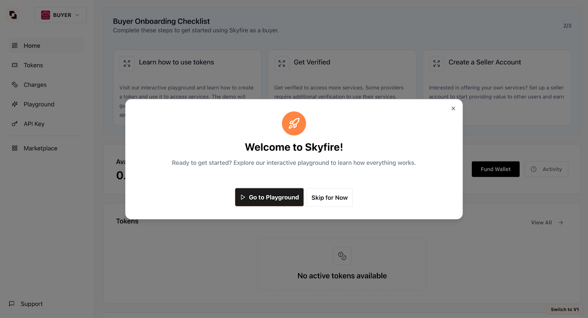

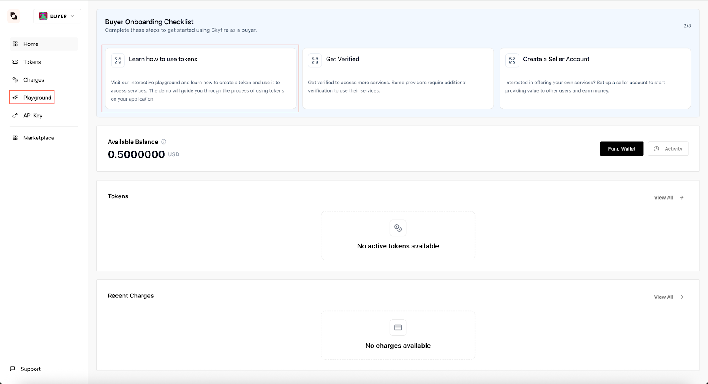

* Click “Go to Playground” in the modal or if you skip that then, click “Learn how to use tokens” or “Playground” (in the left menu) to start buyer onboarding

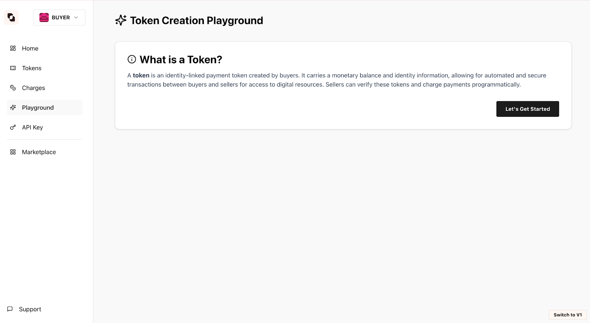

* Create your buyer agent’s first Skyfire API key  
  * Copy and save this API key in a safe place. It will not be displayed in its entirety again.

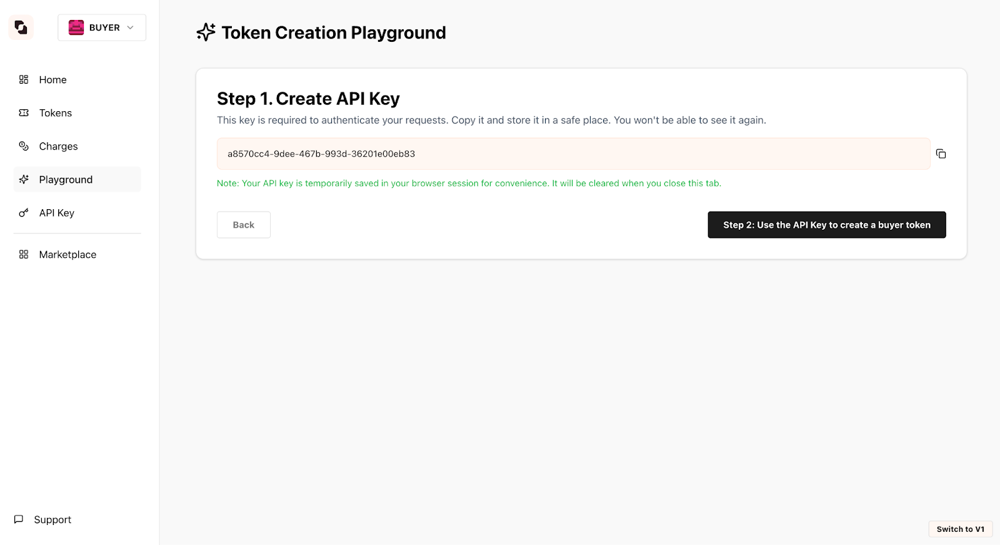

* Create a test pay token  
  * To make it easy, Skyfire’s demonstration service is pre-selected as the seller service.  
  * If you were the buyer, then your buyer agent would make this API call to Skyfire using its API key.

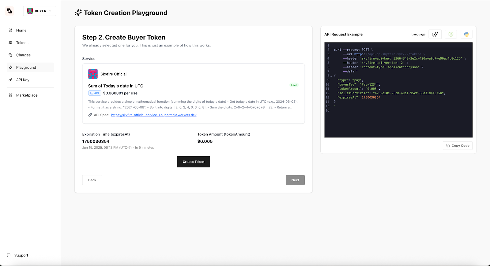

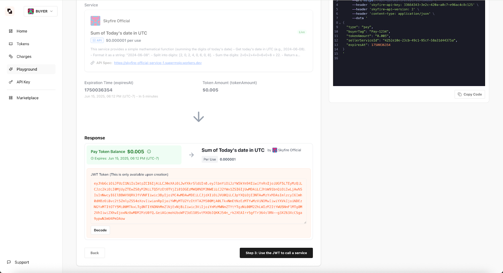

* This creates a **“pay”** token, which is akin to a prepaid debit card that can only be used with this specific seller’s service. You have specified:  
  * tokenAmount: the maximum amount that the seller can charge you  
  * sellerServiceId: the seller service’s ID. This is typically available in the Skyfire marketplace.  
  * buyerTag: your internal ID for the token / transaction, if you have one  
  * expiresAt: when the token expires. This is between 10 seconds and 24 hours in the future.

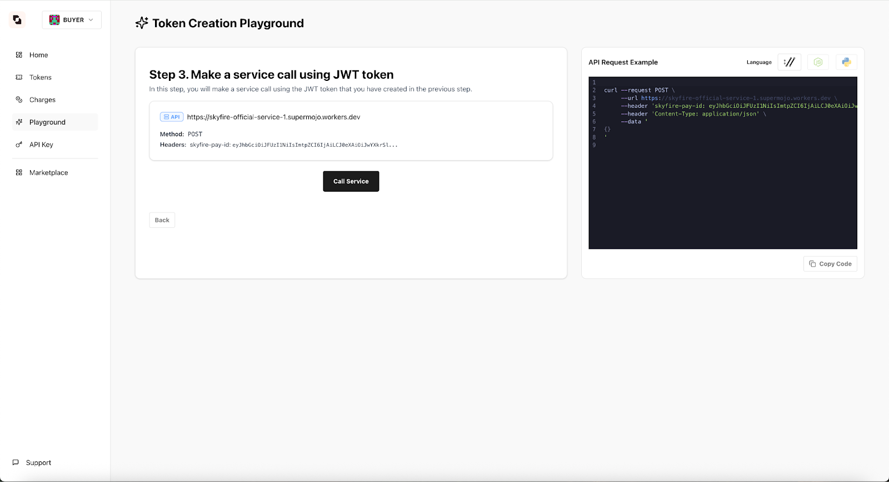

* Pass the pay token to the seller service.  
  * The seller service specifies how the token should be passed e.g. the seller service could include a custom HTTP header or include it in the API request body.

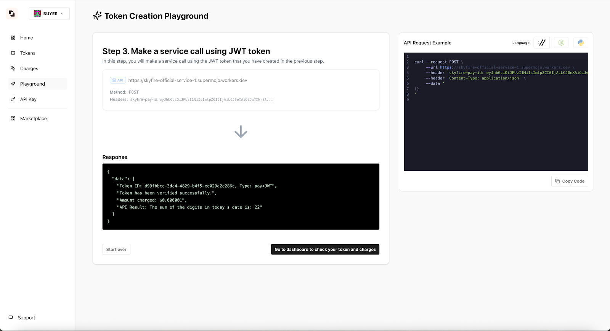

* If you were the seller, then your seller agent / service would  
  * Inspect and verify the token using standard JWKS functionality.  
  * Charge the token to Skyfire using its Skyfire API key.  
    * Tokens can be charged for partial amounts.

#### API Keys

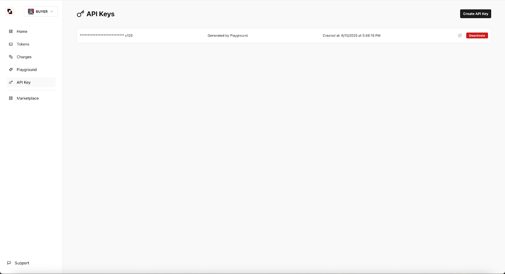

* You can see the API keys that you have created for this agent account.  
* You can deactivate a key and / or create new ones.  
* Your buyer agents will use an API key to create tokens.

#### Tokens

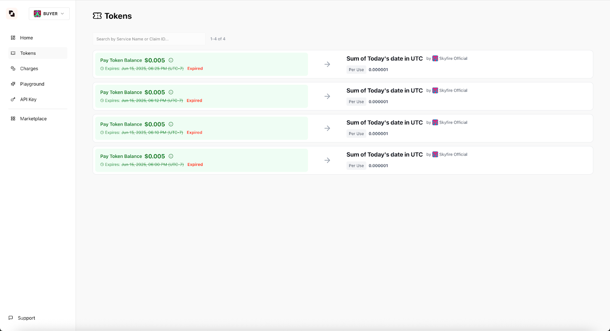

* You can see all the tokens that have been created by your buyer agent along with the seller service that they were created for.

#### Charges

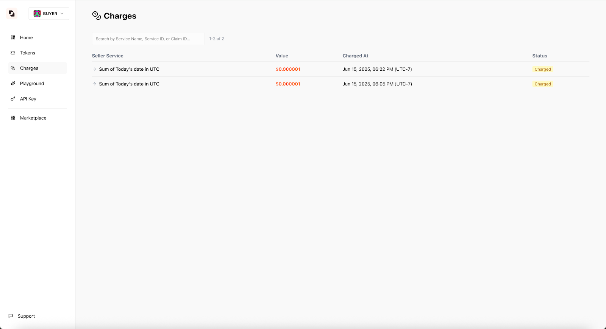

* You can see all the charges that have been made by seller services, on the respective pay and kya+pay tokens that your buyer agent has created.

#### Verification (KYA)

* Verification / KYA applies to both buyers and sellers.  
* Users should get verified so that they can transact with the widest number of buyers and sellers.  
* A Users verification applies to all their agents, both buyers and sellers.  
* Buyers can see whether a seller service is verified or not in the Skyfire marketplace.  
  * Buyers may choose to transact with verified seller services only.  
* Sellers can require that buyers be verified and seller services may require that buyers disclose their verified information via kya and / or kya+pay tokens.  
  * If a buyer is not verified to the required level, then the token creation will fail and the buyer will not be able to transact with the particular seller service.

#### Get Verified

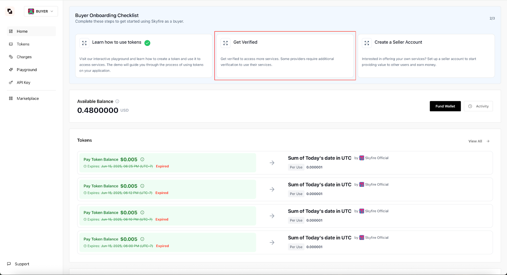

* Click “Get Verified” on the Home screen.

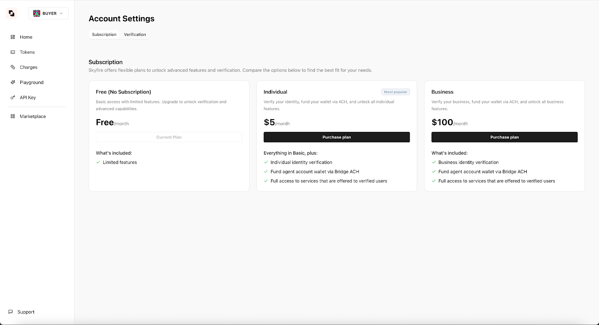

* In order to be verified, you must subscribe to Skyfire.  
* If you want to conduct commerce as an Individual, then select the Individual plan.  
  * Users who choose this typically use their personal email address to create their Skyfire account.  
* If you want to conduct commerce as a Business / Corporation, then select the Business plan.  
  * Users who choose this typically use their employee email address to create their Skyfire account.

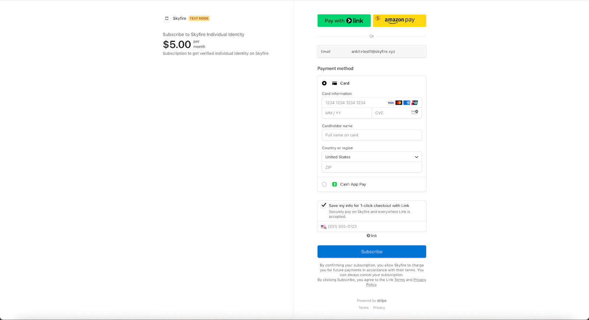

* You will be redirected to the payment screen to complete your subscription.

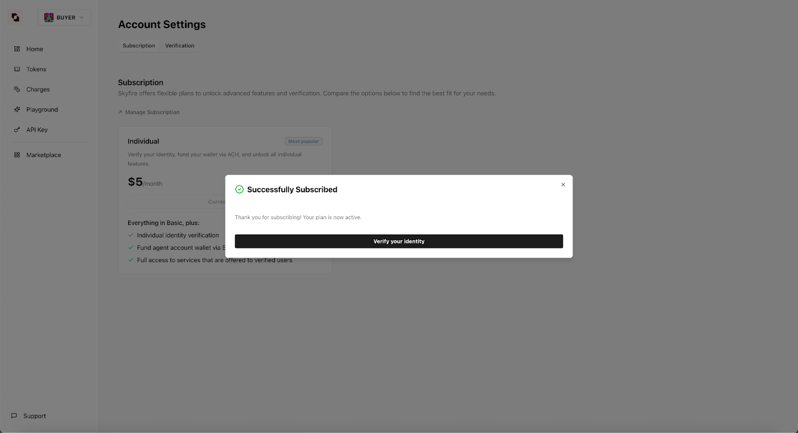

* Once subscribed, you can verify your identity.

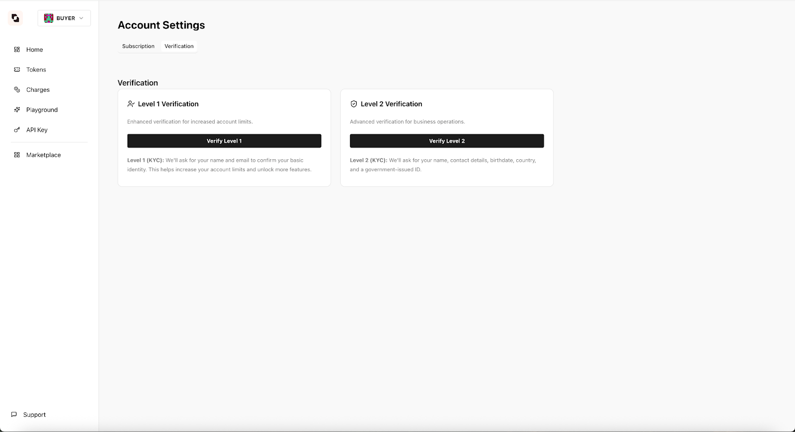

* Your verification is governed by your subscription.  
  * If you subscribe as an Individual, then you can only do Individual verification and your agents will be identified as representing an individual.  
  * If you subscribe as a Business, then you can only do Business verification and your agents will be identified as representing a business.  
* Select which level you want to verify yourself (conduct KYA) for.  
  * Level 2 is a more thorough verification and will give you the widest number of sellers to transact with.  
* Click the respective button to begin your KYA.

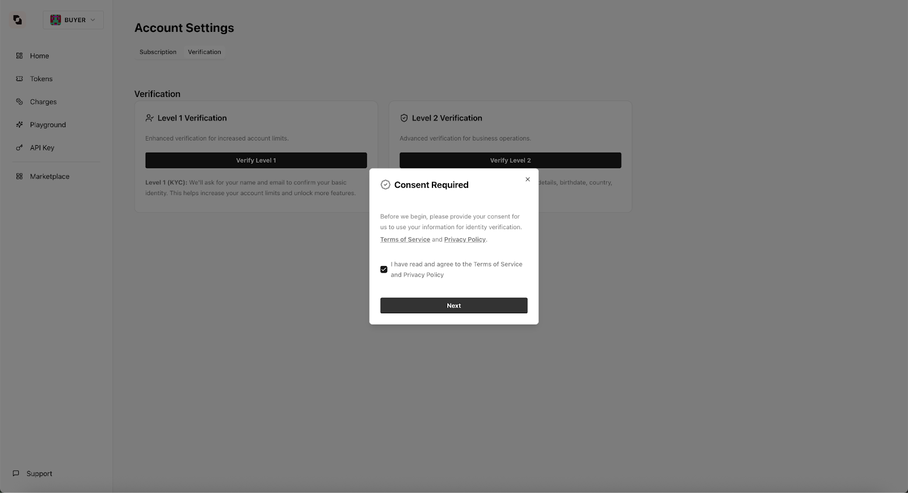

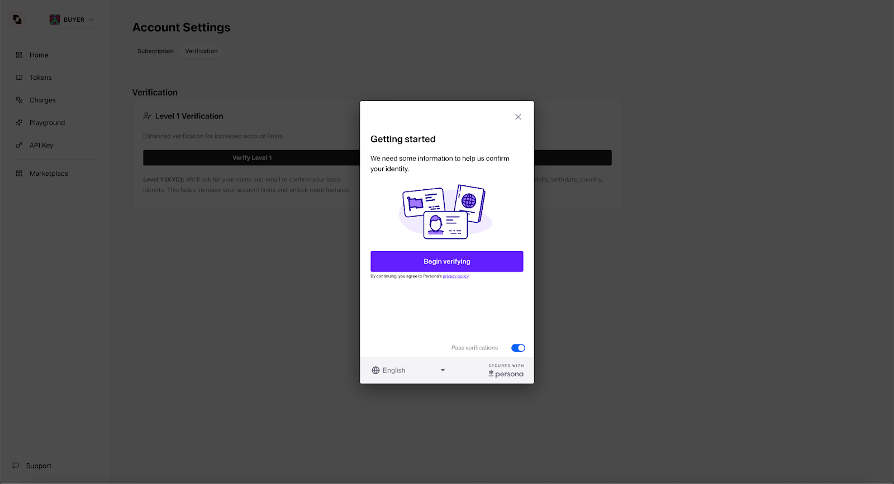

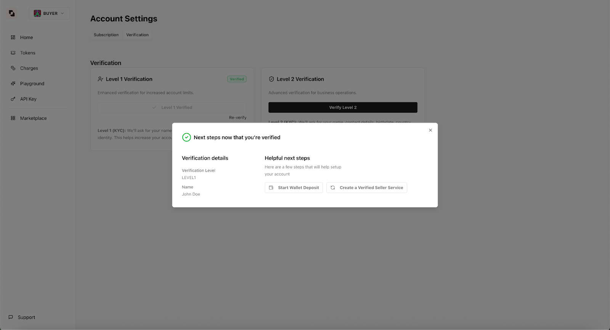

* Grant consent and complete your verification.  
  * You can verify and re-verify any number of times.  
  * Only your last successful verification is considered and that's the identity that your agents acquire from you.  
* As a buyer, you should fund your agent’s wallet so that your agent can purchase goods, services, and / or tools from seller services.  
* As a seller, you should create your seller agent account and a seller service.

### Create Token

#### API Endpoints

* Method  
  * POST  
* Path  
  * {API endpoint}/api/v1/tokens  
* Request Body  
  * {  
    * type: \<string\>,  
      * One of ‘kya’ | ‘pay’ | ‘kya+pay’  
    * buyerTag: \<string\>,  
      * Buyer’s internal identifier for the transaction / token  
    * tokenAmount: \<string\>,  
      * Optional  
      * Must include an amount if this is a ‘pay’ or ‘kya+pay’ token  
      * Must be  
        * Greater than 0  
        * Greater than the minimum token amount specified in the seller service (if any)  
        * Less than or equal to the balance in your agent’s wallet  
      * We have selected string representation as a way to preserve precision in numbers.  
    * sellerServiceId: \<UUID\>,  
      * You can get the seller service ID from the Skyfire marketplace  
    * expiresAt: \<number\>,  
      * Optional  
      * Default: 24 hours in the future  
      * Seconds since the Unix epoch  
      * Must be between 10 seconds and 24 hours (86,400 seconds) in the future.  
    * identityPermissions: \<string\[\]\>  
      * Optional  
      * Default: empty array  
      * Can be specified if this is a ‘kya’ or ‘kya+pay’ token.  
      * Additional identity fields to include in the token.  
      * Allowed field names are  
        * If you have completed an Individual verification  
          * 'selectedCountryCode'  
          * 'selectedIdClass'  
          * 'addressStreet1'  
          * 'addressStreet2'  
          * 'addressCity'  
          * 'addressSubdivision'  
          * 'addressPostalCode'  
          * 'addressCountryCode'  
          * 'birthdate'  
          * 'expirationDate'  
          * 'nameFirst'  
          * 'nameMiddle'  
          * 'nameLast'  
          * 'phoneNumber'  
          * 'issueDate'  
          * 'issuingAuthority’  
        * If you have completed a Business verification  
          * 'businessName'  
          * 'businessPhysicalAddressFull'  
          * 'businessPhysicalAddressCity'  
          * 'businessPhysicalAddressCountryCode'  
          * 'businessPhysicalAddressPostalCode'  
          * 'businessPhysicalAddressStreet1'  
          * 'businessPhysicalAddressStreet2'  
          * 'businessPhysicalAddressSubdivision'  
          * 'businessRegisteredAddressCity'  
          * 'businessRegisteredAddressCountryCode'  
          * 'businessRegisteredAddressPostalCode'  
          * 'businessRegisteredAddressStreet1'  
          * 'businessRegisteredAddressStreet2'  
          * 'businessRegisteredAddressSubdivision'  
          * 'businessTaxIdentificationNumber'  
          * 'birthdate'  
          * 'nameFirst'  
          * 'nameMiddle'  
          * 'nameLast'  
          * 'phoneNumber'  
          * 'selectedCountryCode'  
  * }  
* Response  
  * Success code  
    * 200  
  * Body  
    * {  
      * token: \<string\>  
        * The signed JWT  
    * }  
      

#### Create token sample code

Curl

```shell
curl --request POST \
     --url https://api-qa.skyfire.xyz/api/v1/tokens \
     --header 'skyfire-api-key: <Skyfire Buyer Agent API Key>' \
     --header 'content-type: application/json' \
     --data '
{
  "type": "pay",
  "buyerTag": "Playground-ah9nbdnc6y9",
  "tokenAmount": "0.005",
  "sellerServiceId": "<Skyfire Seller Service ID>",
  "expiresAt": 1750201115
}
'
```

Node / TypeScript

```ts
(async () => {
  const response = await fetch('https://api-qa.skyfire.xyz/api/v1/tokens', {
    method: 'POST',
    headers: {
      'skyfire-api-key': '<Skyfire Buyer Agent API Key>',
      'content-type': 'application/json',
    },
    body: JSON.stringify({
      type: 'pay',
      buyerTag: 'Playground-ah9nbdnc6y9',
      tokenAmount: '0.005',
      sellerServiceId: '<Skyfire Seller Service ID>',
      expiresAt: 1750201115
    }),
  });

  const data = await response.json();
  console.log(data);
})();
```

Python

```py
import requests
import json

url = 'https://api-qa.skyfire.xyz/api/v1/tokens'
headers = {
    'skyfire-api-key': '<Skyfire Buyer Agent API Key>',
    'content-type': 'application/json',
}
payload = {
    'type': 'pay',
    'buyerTag': 'Playground-ah9nbdnc6y9',
    'tokenAmount': '0.005',
    'sellerServiceId': '<Skyfire Seller Service ID>',
    'expiresAt': 1750201115
}

response = requests.post(url, headers=headers, data=json.dumps(payload))
print(response.json())
```

### Onboard Seller

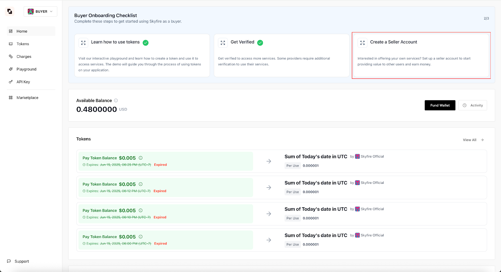

* Click “Create a Seller Account” on the Home screen.

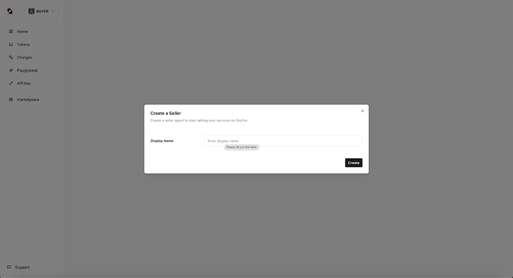

* Set a “Display Name”


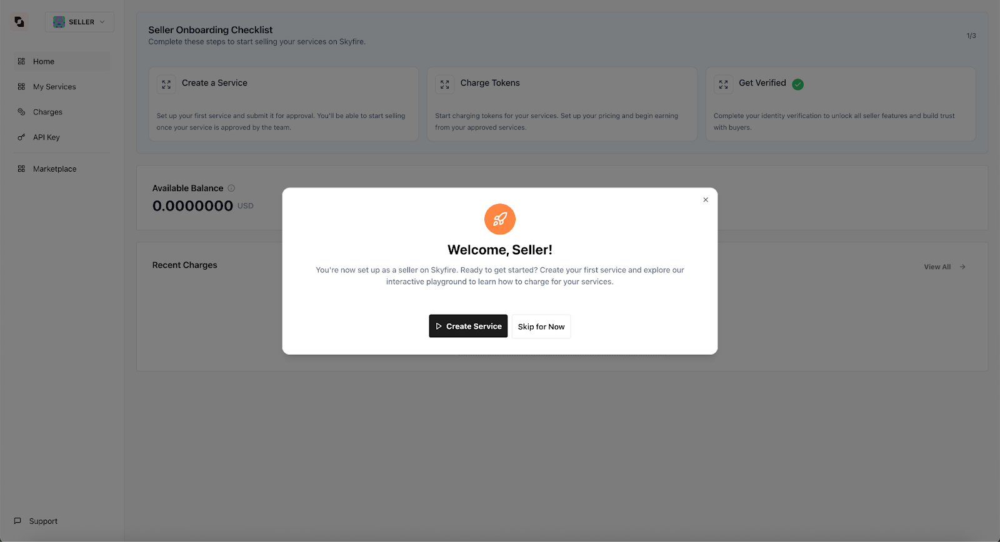

* Click “Create Service”

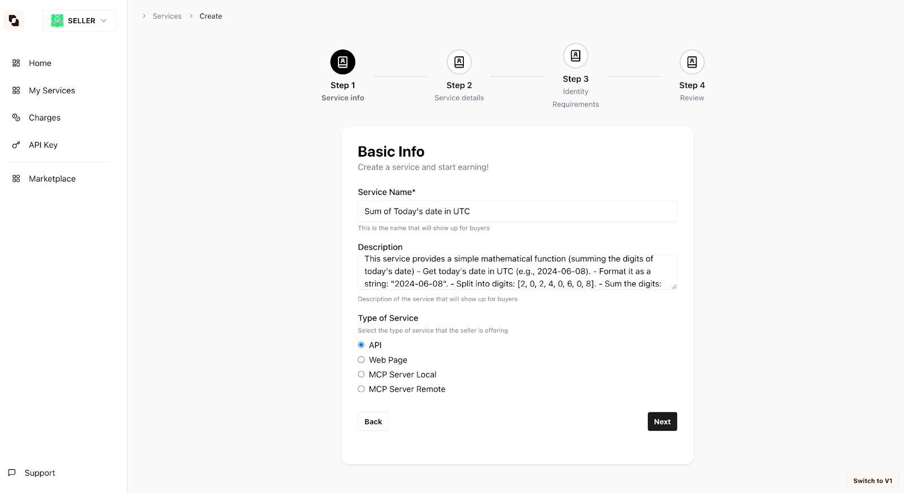

* Provide the Name, Description, and select the Type of Service.

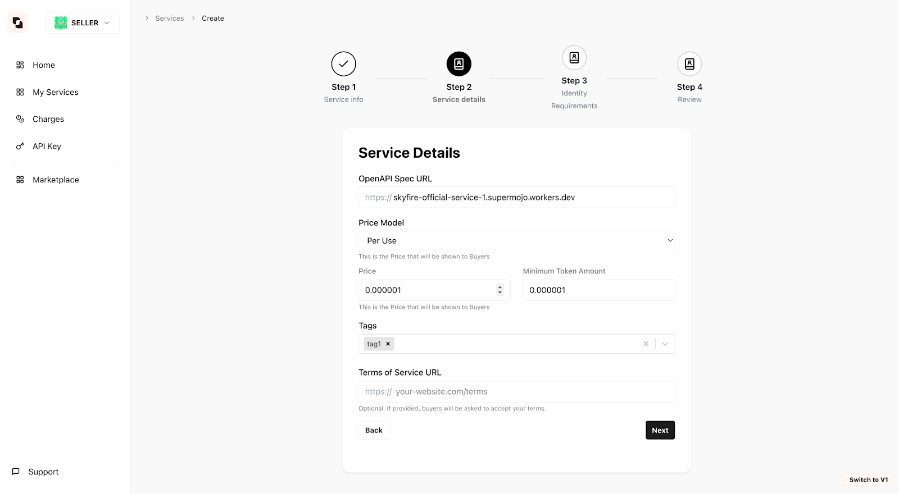

* Depending on the Type of Service, you will be asked to provide the URL of the OpenAPI spec or the website or the MCP server.  
* Provide the URL, pricing, and Terms of Service information for your seller service.

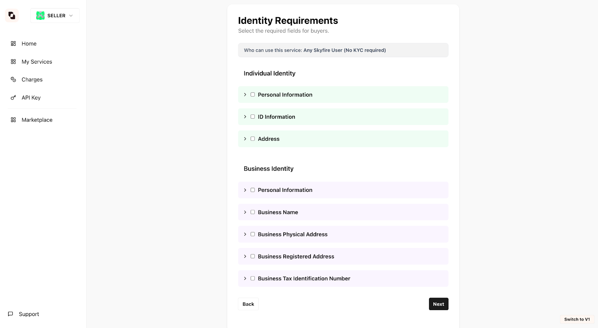

* Finally specify the identity requirements for your seller service.  
  * Your seller service can require buyer agents representing individuals, businesses, or both, to perform KYA and include identity information in the kya and kya+pay tokens that they send to your service.  
  * A buyer agent can perform only one of an individual KYA or a business KYA so your seller service should consider only the information applicable to the particular buyer agent.  
  * This step is optional. Your seller service does not have to require KYA from buyer agents unless you have a particular business need.

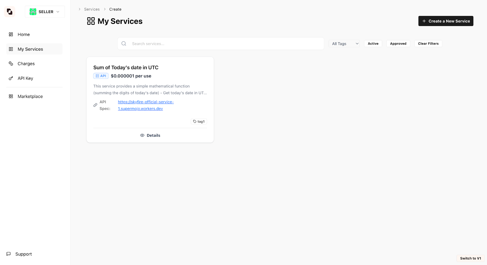

* Your seller service will become available on the Skyfire platform after it is approved by Skyfire.  
  * The approval process typically takes less than a day.

#### API Keys

* You can see the API keys that you have created for your seller agents / seller services.  
* You can deactivate a key and / or create new ones.  
* Your seller agents / seller services will use an API key to charge pay and kya+pay tokens.

#### Charges

* You can see all the charges that have been made by your seller services, on the respective pay and kya+pay tokens that buyer agents have sent to them.

### Verify Token

```ts
// Get the key set from .../.well-known/jwks.json
const jwks = await getJWKS()

// Verify the signature and extract the token header and payload 
const verifier = jose.createLocalJWKSet(jwks)
const { payload, protectedHeader } = await jose.jwtVerify(
  token.token,
  verifier,
  {
    issuer: 'https://skyfire.xyz/',
    ...
  }
```

You can verify one or more of the following

* In ‘kya’ tokens (‘typ’ is ‘kya+JWT’)  
  * Signature  
  * ‘alg’ claim is ‘ES256’  
  * ‘ssi’ claim is set to your Skyfire seller service ID  
  * ‘iat’ claim is in the past  
  * ‘exp’ claim is now or in the future  
  * ‘iss’ claim is set to ‘[https://api.skyfire.xyz/](https://skyfire.xyz/)’  
  * ‘jti’ claim is set to a UUID  
  * ‘aud’ claim is set to your Skyfire agent account ID  
  * ‘sub’ claim is set to a UUID  
    * This is the buyer agent account ID  
  * The ‘bid’ claim contains the buyer identity fields in a key-value map (JSON object)  
* In ‘pay’ tokens (‘typ’ is ‘pay+JWT’)  
  * Signature  
  * ‘alg’ claim is ‘ES256’  
  * ‘ssi’ claim is set to your Skyfire seller service ID  
  * ‘iat’ claim is in the past  
  * ‘exp’ claim is now or in the future  
  * ‘iss’ claim is set to ‘[https://api.skyfire.xyz/](https://skyfire.xyz/)’  
  * ‘jti’ claim is set to a UUID  
  * ‘aud’ claim is set to your Skyfire agent account ID  
  * ‘sub’ claim is set to a UUID  
    * This is the buyer agent account ID  
  * ‘value’ claim is \> 0  
  * ‘amount’ claim is \> 0  
  * ‘cur’ claim is set to ‘USD’  
  * ‘sps’ claim matches the pricing scheme that you configured in your seller service  
  * ‘spr’ claim matches the price that you configured in your seller service  
* In ‘kya+pay’ tokens (‘typ’ is ‘kya+pay+JWT’)

Both ‘kya’ and ‘pay’ token validations as above

### Charge Token

#### API Endpoints

* Method  
  * POST  
* Path  
  * {API endpoint}/api/v1/tokens/charge  
* Request Body  
  * {  
    * token: \<string\>  
      * The signed JWT received from the buyer agent in your API call  
    * chargeAmount  
      * The amount to charge from the token.  
      * Must be  
        * Greater than 0  
        * Less than or equal to the tokenAmount.  
        * Less than or equal to the balance on the token if you have charged a partial amount to this token already.  
          * The balance will be less than or equal to the tokenAmount.  
          * We will be adding a token introspection API that you can use to determine the balance on a token if you are unable to keep track of your partial amount charges.  
      * We have selected string representation as a way to preserve precision in numbers.  
* Processing  
  * The token ‘typ’ must be ‘pay’ or ‘kya+pay’.  
  * The seller is expected to enforce the ‘exp’ claim of a token i.e. reject tokens that have expired.  
  * However, a seller is allowed to charge a token for up to 24 hours after it has expired.  
    * In this case, Skyfire assumes that the seller did not accept an already expired token from the buyer.  
* Response  
  * Success code  
    * 200  
  * Body  
    * {  
      * amountCharged: \<string\>  
        * The amount that Skyfire charged and moved from the buyer’s wallet to the seller’s wallet.  
      * remainingBalance: \<string\>  
        * The remaining balance on the token.  
        * This is typically \> 0 and \< tokenAmount.  
    * }

#### Charge token sample code

Node / TypeScript Example

```ts
  // JWT verification
  const JWKS = createRemoteJWKSet(new URL(JWKS_URL));
  try {
    const { protectedHeader } = await jwtVerify(skyfireToken, JWKS, {
      issuer: JWT_ISSUER,
      audience: JWT_AUDIENCE,
      algorithms: [JWT_ALGORITHM]
    });
    decodedHeader = protectedHeader;
  } catch (err) {
    console.error('Error while verifying token: ' + err);

    if (err instanceof errors.JOSEError) {
      return Response.json(
        {
          error: `Your JWT token is invalid`,
          errorCode: err.code,
          message: err.message
        },
        { status: 401 }
      );
    }

    return Response.json(
      { error: `Something went wrong while verifying your JWT token` },
      { status: 401 }
    );
  }

  let decodedToken;
  try {
    decodedToken = jwtDecode(skyfireToken);
  } catch (err) {
    console.error('Error while decoding token: ' + err);

    return Response.json({ error: 'Invalid JWT token' }, { status: 401 });
  }

  /**
   * Charge Token
   */
  if (decodedHeader.typ === 'kya+pay+JWT' || decodedHeader.typ === 'pay+JWT') {
    try {
      const response = await chargeToken(skyfireToken);
      responseMessage.push(response);
    } catch (err) {
      console.error('Error while charging token: ' + err);

      return Response.json(
        {
          error: `Couldn't charge your ${getTokenInfo(skyfireToken)} token`,
          message: err instanceof Error ? err.message : 'Unknown error'
        },
        { status: 400 }
      );
    }
  }

  const chargeToken = async (skyfireToken: string) => {
  let response;

  try {
    response = await fetch(`${SKYFIRE_API_URL}/api/v1/tokens/charge`, {
      method: 'POST',
      headers: {
        'Content-Type': 'application/json',
        'skyfire-api-key': <Skyfire Seller Agent API Key>,
      },
      body: JSON.stringify({
        token: skyfireToken,
        chargeAmount: AMOUNT_TO_CHARGE
      })
    });
  } catch (err) {
    console.error('Error while charging token: ' + err);
    throw new Error(
      err instanceof Error ? err.message : 'Unknown error while charging token'
    );
  }

  const res: {
    amountCharged: string;
    remainingBalance: string;
  } = await response.json();

};
```

**Step 3:**   
Add license related files (marked in yellow) to the repo. [Hyperledger Anoncreds](https://github.com/hyperledger/anoncreds-spec) is a good example of how to apply the license. Since we don’t have a Working Group yet, we can start somewhere simpler and set everything up for the further development of the KYAPay Protocol

0.\_CS\_Contributor\_License\_Agreement.md    
[https://github.com/CommunitySpecification/Community\_Specification/blob/main/.0\_CS\_Contributor\_License\_Agreement.md](https://github.com/CommunitySpecification/Community_Specification/blob/main/.0_CS_Contributor_License_Agreement.md)

1.\_Community\_Specification\_License[\-v1.md](http://-v1.md)  
[https://github.com/CommunitySpecification/Community\_Specification/blob/main/1.\_Community\_Specification\_License-v1.md](https://github.com/CommunitySpecification/Community_Specification/blob/main/1._Community_Specification_License-v1.md)

2.\_Scope.md

**Scope**  
We have released the core token structure and a set of example APIs in this repository to invite early feedback from the community. This release is intended as a starting point and serves to gather input, validate design decisions, and assess interest in forming or joining a formal Working Group.

The Working Group will steward the development of the full **v1.0 specification**, and its scope of work will be clearly defined upon that release. We welcome participation from developers, protocol designers, infrastructure providers, and other stakeholders interested in shaping a shared identity and transaction layer for agentic AI.

3.\_Notices.md

[https://github.com/CommunitySpecification/Community\_Specification/blob/main/3.\_Notices.md](https://github.com/CommunitySpecification/Community_Specification/blob/main/3._Notices.md)

4.\_License.md  
[https://github.com/CommunitySpecification/Community\_Specification/blob/main/4.\_License.md](https://github.com/CommunitySpecification/Community_Specification/blob/main/4._License.md)

5.\_[Governance.md](http://Governance.md)

This document provides the governance policy for specifications and other documents developed using the Community Specification process in a repository (each a “Working Group”). 

[https://github.com/CommunitySpecification/Community\_Specification/blob/main/5.\_Governance.md](https://github.com/CommunitySpecification/Community_Specification/blob/main/5._Governance.md)

6.\_[Contributing.md](http://Contributing.md)

[https://github.com/CommunitySpecification/Community\_Specification/blob/main/6.\_Contributing.md](https://github.com/CommunitySpecification/Community_Specification/blob/main/6._Contributing.md) and add the below after the first paragraph:

If you are interested in becoming a contributor, please contact xxx with the following information to indicate your interest:

**Name:** John Doe  
**Individual or Organization**: If you are representing an organization, please share the organization’s name  
**Email:**   
**Github Handle:** 

8\. \_Code\_of\_Conduct.md

[https://github.com/CommunitySpecification/Community\_Specification/blob/main/8.\_Code\_of\_Conduct.md](https://github.com/CommunitySpecification/Community_Specification/blob/main/8._Code_of_Conduct.md) (can use something different from the template language if you prefer)

LICENSE \- This document should be the source code license details, e.g. Apache 2.0, MIT   
Example: [https://github.com/hyperledger/anoncreds-spec/blob/main/LICENSE](https://github.com/hyperledger/anoncreds-spec/blob/main/LICENSE)

[MAINTAINERS.md](http://MAINTAINERS.md)

**Active Maintainers** 

| Name | Github               |
| :---- |:---------------------|
| **Ankit Agarwal** | **@skyfire-ankit**   |
| **Supreet Kaur** | **@skyfire-supreet** |
| **Andrew Stitt** | **@super-drew**      |

Clear guidance on how to become a maintainer and remove a maintainer will be provided when the Working Group is formally launched.  
   
[README.md](http://README.md) 

**KYAPay** 

This repository contains the source content for the KYAPay open specification. It currently includes the core token structure and a set of example APIs of KYAPay, an identity-linked payment protocol for agent-to-agent and agent-to-service interactions using JWT tokens. The full specification v1.0 of KYAPay is aimed to be released soon in this repo. 

* This work is being conducted under the [Community Specification License v1.0](https://github.com/hyperledger/anoncreds-spec/blob/main/1._Community_Specification_License-v1.md)  
* The initial whitepaper of KYAPay can be found:   
* The core token structure can be found:   
* The example APIs can be found: 

We are in active conversations with partners and ecosystem stakeholders about collaboratively developing the KYAPay Protocol. Once the Working Group is officially formed, more details will be released.
